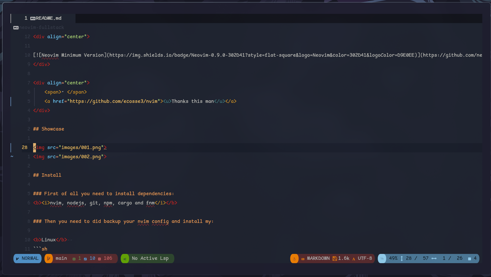

# <h1 align="center">🔥NeoVim for Fullstack Web Dev</h1>

<div align="center">

  <span> • </span>
    	<a href="#install">Install</a>
  <span> • </span>
    	<a href="#first-steps-after-install">First steps</a>
  <span> • </span>
    	<a href="#mapping">Mapping</a>
  <span> • </span>
        <a href="#Features">Features</a>
  <p></p>
</div>

<div align="center">

[](https://github.com/neovim/neovim)
</div>

<div align="center">
    <span>• </span>
    <a href="https://github.com/ecosse3/nvim"><u>Thanks this man</u></a>
</div>

## Showcase



## Install

### First of all you need to install dependencies:
<b><i>nvim, nodejs, git, npm, cargo and fnm</i></b>

### Then you need to did backup your nvim config and install my:

<b>Linux</b>  
```sh
  mv ~/.config/nvim ~/.config/nvim_backup
  git clone https://github.com/gudkovWay/neovim-fullstack
  mkdir ~/.config/nvim/
  mv neovim-fullstack/nvim ~/.config/nvim/
```  

### Now u can run neovim. With first run Mason will be install for u all plugins.
<b>After that, u need edit plugins.lua file (dir: nvim/lua/config/plugins.lua) and add your custom folders into the dashboard (these plugin in the bottom of this file).</b>

```sh
nvim ~./config/nvim/lua/config/plugins.lua
# Press G ( its fast and easy forward to end of file )
```

<b>Mapping may know from these file:</b>
```sh
nvim ~./config/nvim/lua/config/keymappings.lua
```
