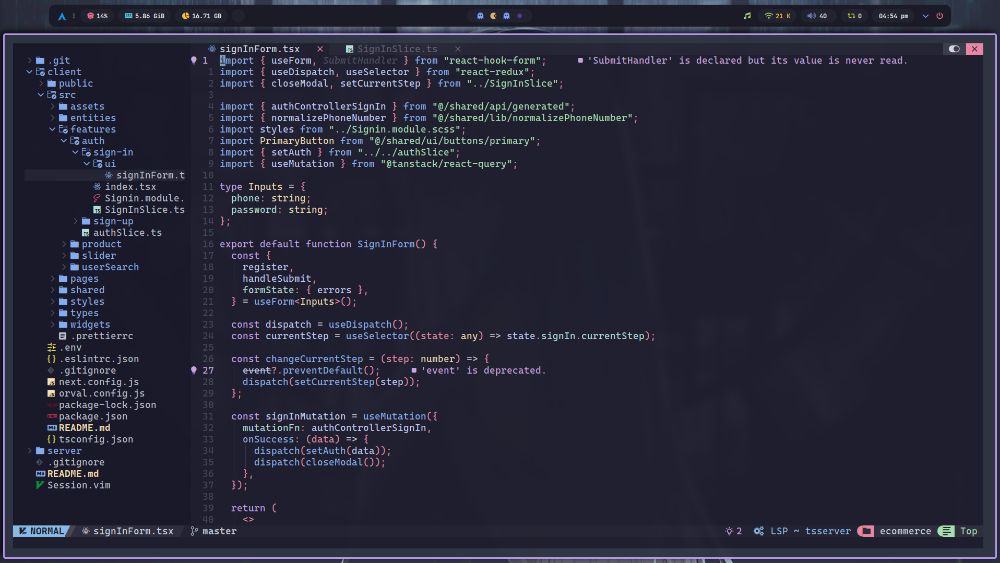
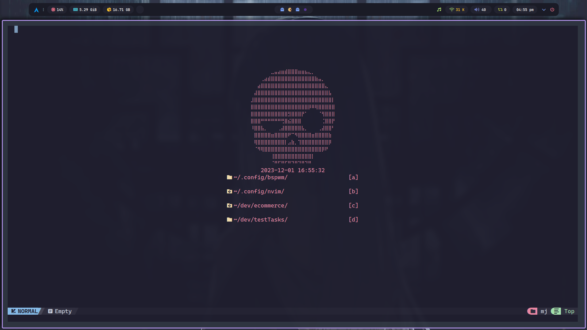

# <h1 align="center">🔥NeoVim for Fullstack Web Dev</h1>

<div align="center">

  <span> • </span>
    	<a href="https://nvchad.com/docs/quickstart/install">Install</a>
  <span> • </span>
    	<a href="https://nvchad.com/docs/quickstart/install">First steps</a>
  <span> • </span>
    	<a href="https://nvchad.com/docs/quickstart/install">Mapping</a>
  <span> • </span>
        <a href="https://nvchad.com/docs/features">Features</a>
  <p></p>
</div>

<div align="center">

[](https://github.com/neovim/neovim)
</div>

## Showcase




## Install

### First of all you need to install dependencies:
<b><i>git, npm, nodejs and neovim</i></b>

### Then you need to did backup your nvim config and install my:

<details>
<summary> Linux</summary>
```sh
mv ~/.config/nvim ~/.config/nvim_backup
cd ~/.config
git clone https://github.com/gudkovWay/neovim-fullstack nvim
```
</details>

### Now u can run neovim. With first run Mason will be install for u all plugins.

## First steps after install

First, dive into the configure structure:
```sh
.
├── init.lua
├── lazy-lock.json
├── LICENSE
└── lua
    ├── core            # Core of nvchad
    │   ├── bootstrap.lua
    │   ├── default_config.lua
    │   ├── init.lua
    │   ├── mappings.lua
    │   └── utils.lua
    ├── custom # Custom plugins for nvchad
    │   ├── chadrc.lua
    │   ├── configs #Configs for custom plugins
    │   │   ├── formatter.lua
    │   │   ├── lint.lua
    │   │   ├── lspconfig.lua
    │   │   ├── null-ls.lua
    │   │   └── overrides.lua
    │   ├── highlights.lua
    │   ├── mappings.lua
    │   ├── plugins.lua #Plugins installer, small init config.
    │   └── README.md
    └── plugins # NvChad plugins
        ├── configs
        │   ├── cmp.lua
        │   ├── lazy_nvim.lua
        │   ├── lspconfig.lua
        │   ├── mason.lua
        │   ├── nvimtree.lua
        │   ├── others.lua
        │   ├── telescope.lua
        │   └── treesitter.lua
        └── init.lua
```


<b>After that, u need edit custom plugins.lua file and add your custom folders into the dashboard.</b>

```sh
nvim ~./config/nvim/lua/custom/plugins.lua
# Pres double ] ( its fast and easy forward to end of file )
```

<b>If u know what u do, change mappings for u mind in file:</b>
```sh
nvim ~./config/nvim/lua/custom/mappings.lua
```

## Mapping
<b>leader = space </b>

<details>
    <summary>Normal Mode</summary>
    | Key | Function |
    | --- | --- |
    | <kbd>h</kbd> | Move left |
    | <kbd>j</kbd> | Move down |
    | <kbd>k</kbd> | Move up |
    | <kbd>l</kbd> | Move right |
    | <kbd>[[</kbd> | Move to first line |
    | <kbd>]]</kbd> | Move to last line |
    | <kbd>w</kbd> | Move to next word |
    | <kbd>b</kbd> | Move to previous word |
    | <kbd>W</kbd> | Move to next word after space |
    | <kbd>B</kbd> | Move to previous word before space |
    | <kbd>0</kbd> | Move to start of line |
    | <kbd>$</kbd> | Move to end of line |
    | <kbd> di{</kbd> | Delete inside {} |
    | <kbd> di[</kbd> | Delete inside [] |
    | <kbd> di(</kbd> | Delete inside () |
    | <kbd> d{number}j</kbd>| Delete {number} lines after |
    | <kbd> d{number}k</kbd>| Delete {number} lines before |
    | <kbd> d$</kbd> | Delete full line |
    | <kbd> dG </kbd> | Delete to last line |
    | <kbd> dt{letter}</kbd> | Delete to {letter} |
    | <kbd> yiw</kbd> | Copy word |
    | <kbd> yip</kbd> | Copy paragraph |
    | <kbd> y{number}j </kbd> | Copy {number} lines after |
    | <kbd> y{number}k </kbd> | Copy {number} lines before |
    | <kbd> y$</kbd> | Copy full line|
    | <kbd> yG</kbd> | Copy to last line |
    | <kbd> p</kbd> | Paste |
    | <kbd> u </kbd> | Undo |
    | <kbd> leader + r + n </kbd> | Toggle relative number line |
    | <kbd> leader + t + h </kbd> | Choose nvchad theme |
    | <kbd> leader + f + w </kbd> | live grep by word |
    | <kbd> leader + f + f </kbd> | live grep by file |
    | ...future... | ...future... |
</details>
<details>
    <summary>Insert Mode</summary>
    | Key | Function |
    | --- | --- |
    | <kbd>jj</kbd> | Turn off insert mode |
    | <kbd>CTRL+SHIFT+V</kbd> | paste |
    | <kbd>CTRL+SHIFT+X</kbd> | cut |
    | <kbd>CTRL+SHIFT+C</kbd> | copy |
    | //TODO: | todo highlight |
    | ...future... | ...future... |
</details>

## Features

[ ] Move all the mapping to the list
[ ] Add more languages programming for backend
[ ] Add compatibility with Windows, MacOS
